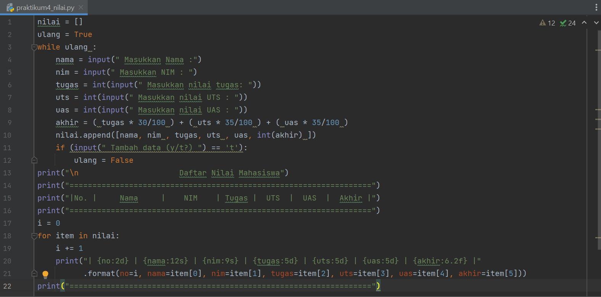
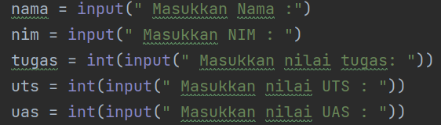
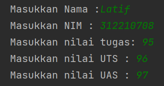
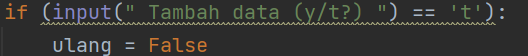
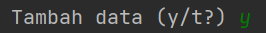

# Praktikum 4
## Program menghitung nilai

Pada tugas kali ini, program diminta untuk bisa memasukkan data sebanyak banyaknya, maka saya menggunakan syntax

run program

dan menggunakan perulangan

run program

maka user di haruskan untuk memilih 'y' untuk memasukkan data kembali atau 't' untuk menghasilkan output

