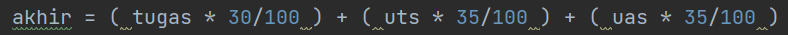
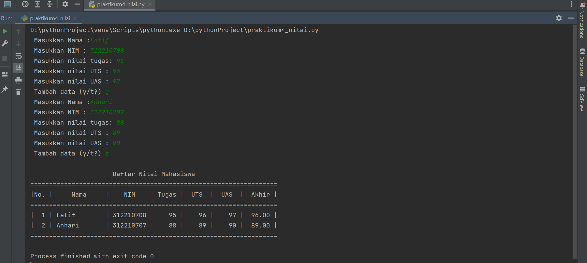
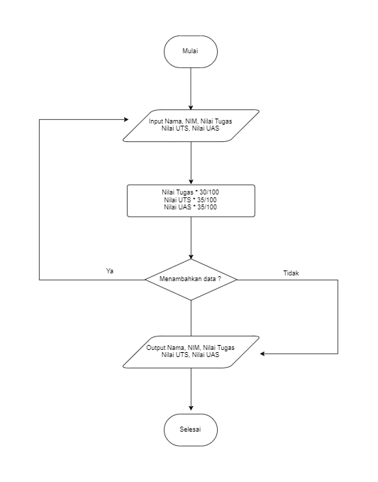

# Praktikum 4
## Program menghitung nilai

Pada tugas kali ini, program diminta untuk bisa memasukkan data sebanyak banyaknya, maka saya menggunakan syntax

run program

dan menggunakan perulangan

run program

maka user di haruskan memilih 'y' untuk kembali ke proses input data atau 't' untuk menghasilkan output

untuk proses penghitungan nilai, menggunakan syntax

### Output 

### Flowchart program menghitung nilai

